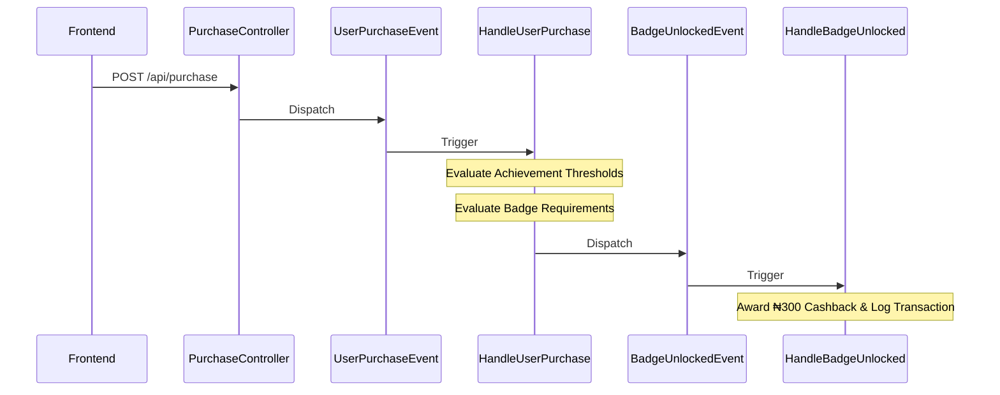

# Bumpa Loyalty Program

A robust, brand-aligned loyalty management system featuring achievement tracking, tiered badge rewards, and an automated cashback system.

## Getting Started

### Prerequisites
- PHP 8.2+ & Composer
- Node.js 18+ & npm
- MySQL (or your preferred database)

---

## Backend Setup (Laravel)

1. **Install Dependencies**
   ```bash
   cd backend
   composer install
   ```

2. **Environment Configuration**
   ```bash
   cp .env.example .env
   php artisan key:generate
   ```
   *Ensure `DB_CONNECTION` is set up (default is `sqlite`).*

3. **Database Migration & Seeding**
   This project uses migrations to define the schema and seeders to initialize achievements and badges.
   ```bash
   php artisan migrate --seed
   ```
   *This will create the tables and seed `Beginner`, `Intermediate`, and `Advanced` badges, along with purchase-based achievements.*

4. **Start the Server**
   ```bash
   php artisan serve
   ```

---

## Frontend Setup (React + Vite)

1. **Install Dependencies**
   ```bash
   cd frontend
   npm install
   ```

2. **Environment Configuration**
   Create a `.env` file in the `frontend` root:
   ```env
   VITE_API_URL=http://127.0.0.1:8000/api
   ```

3. **Start Development Server**
   ```bash
   npm run dev
   ```

---

## API Documentation

### Authentication

#### **Register**
`POST /api/register`
- **Body**:
  ```json
  {
    "name": "Taiwo Akerele",
    "email": "taiwo@example.com",
    "password": "password"
  }
  ```
- **Response**: `201 Created` with User object and Sanctum token.

#### **Login**
`POST /api/login`
- **Body**:
  ```json
  {
    "email": "taiwo@example.com",
    "password": "password"
  }
  ```
- **Response**: `200 OK` with User object and Sanctum token.

### Loyalty & Transactions

#### **Process Purchase**
`POST /api/purchase` (Requires Authenticated Token)
- **Body**:
  ```json
  {
    "amount": 5000
  }
  ```
- **Response**:
  ```json
  {
    "message": "Purchase successful",
    "balance": 4900,
    "cashback": "Congratulations! You unlocked the Beginner badge and earned ₦300 cashback."
  }
  ```

#### **Get Achievements & Badges**
`GET /api/users/{user_id}/achievements` (Requires Authenticated Token)
- **Parameters**: `user_id` (Integer validation enforced)
- **Response**:
  ```json
  {
    "unlocked_achievements": ["First Purchase", "3 Purchases"],
    "next_available_achievements": ["5 Purchases", "10 Purchases"],
    "current_badge": "Beginner",
    "next_badge": "Intermediate",
    "remaining_to_unlock_next_badge": 1
  }
  ```

#### **Get Transaction History**
`GET /api/transactions?page=1&limit=10` (Requires Authenticated Token)
- **Parameters**: `page` (optional), `limit` (optional, defaults to 20)
- **Response**:
  ```json
  {
    "data": [
        {
            "id": 1,
            "user_id": 3,
            "amount": "100.00",
            "type": "purchase",
            "created_at": "2026-04-16T19:41:41.000000Z"
        }
    ],
    "total": 1,
    "page": 1,
    "limit": 10,
    "totalPages": 1
  }
  ```

---

## Architectural Flow & Event-Driven System

The system is built on a decoupled, event-driven architecture using Laravel's core features to ensure scalability and separation of concerns.

### 1. Client Initiation (Frontend)
A user performs an action (e.g., completes a purchase) on the React dashboard. This sends an authenticated `POST /api/purchase` request to the backend.

### 2. Controller & Persistence
The `PurchaseController` validates the request and records the purchase in the database. Instead of embedding reward logic directly in the controller, it dispatches a `UserPurchaseEvent`.

### 3. Event Handling (The Observer Pattern)
- **UserPurchaseEvent**: Fired immediately after a purchase is recorded. It acts as a signal that the user's purchase state has changed.
- **HandleUserPurchase (Listener)**: Reacts to the purchase event:
    - **Achievement Logic**: It checks if the user's total purchase count meets any `Achievement` thresholds (e.g., "1st Purchase"). If met, it attaches the achievement and fires an `AchievementUnlockedEvent`.
    - **Badge Logic**: It then checks if the user's total achievement count qualifies them for a new `Badge` (e.g., "Beginner"). If a new badge is unlocked, it attaches it and fires a `BadgeUnlockedEvent`.

### 4. Reward Execution
- **HandleBadgeUnlocked (Listener)**: Listens specifically for when a user earns a new badge.
    - **Cashback Trigger**: Upon a badge being unlocked, the system automatically triggers a **₦300 Cashback** payment.
    - **Transaction Recording**: It increments the user's balance and logs a `cashback` type transaction for auditability and transparency.

### Key Logic Components

| Component | Responsibility |
| :--- | :--- |
| **UserPurchaseEvent** | Dispatched when a new purchase is successfully recorded. |
| **AchievementUnlockedEvent** | Dispatched when a user reaches a specific achievement threshold. |
| **BadgeUnlockedEvent** | Dispatched when a user qualifies for a new level/badge. |
| **HandleUserPurchase** | Evaluates purchase counts and achievement progress to trigger rewards. |
| **HandleBadgeUnlocked** | Processes the automated ₦300 cashback whenever a badge is unlocked. |

### Implementation Summary Flow



---

## Features
- **Automated Cashback**: Logic-driven rewards triggered upon badge acquisition.
- **Strict Validations**: Integer-based user validation and cross-user data protection.
- **Dynamic Dashboard**: Real-time balance updates and slide-in notifications for rewards.
